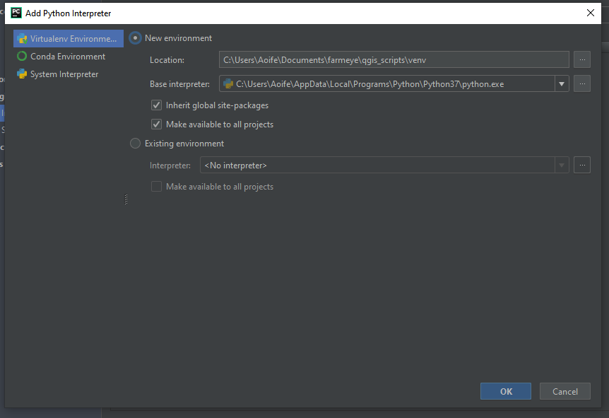
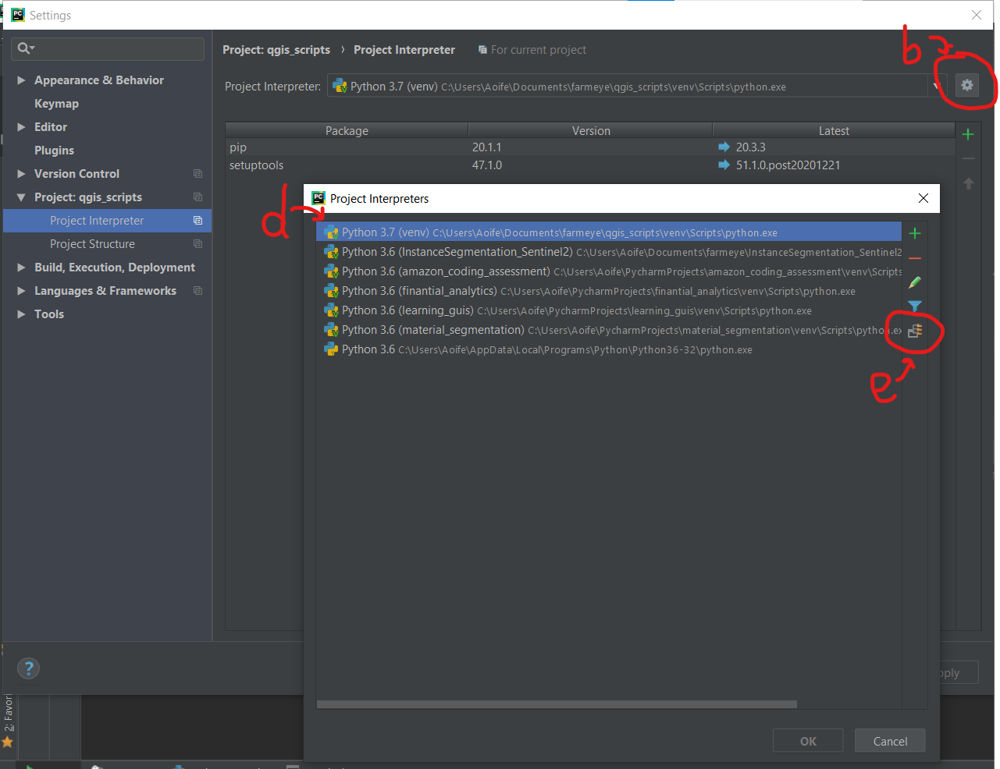

# Python-QGIS development environment setup

**21/12/20:** This is a live document. More steps and information will be added as this project progresses.

## Python Dependencies
1. PyQT5
1. python-dotenv

## Software Installation
1. Install QGIS in OSGeo4W **(64-bit)**  
    QGIS downloads page: https://qgis.org/en/site/forusers/download.html  
    Link directly to OSGeo4W installer: https://download.osgeo.org/osgeo4w/osgeo4w-setup-x86_64.exe 
1. Install Python 3.7 (64-bit)  
    https://www.python.org/downloads/windows/  
    NB **64-bit** Python to match 64-bit QGIS installation  
1. Install Pycharm (only required for development)  
    https://www.jetbrains.com/pycharm/download/#section=windows 

## Set up Pycharm Environment
1. Open Pycharm
1. Configure new virtual environment  
    Choose **base interpreter** as the 64-bit python interpreter you installed in step 2 of `Software Installation`.

    

1. Optionally verify venv interpreter
1. Add QGIS paths to PYTHONPATH environment variable. 
    1. Settings > Project> Project Interpreter
    1. Click the cog icon to the right of ‘Project Interpreter’ field
    1. Select ‘Show All’
    1. Click on Interpreter for this project
    1. Click icon ‘Show paths for the selected interpreter’
    1. Add the following paths  
        **path\to\qgis\installation**\apps\qgis\python  
        **path\to\qgis\installation**\apps\qgis\python\plugins  
        **path\to\qgis\installation**\apps\Python37\lib\site-packages  
        (Note **path\to\qgis\installation** will differ between Windows and Linux)
    1. Click all ‘ok’ buttons
    1. Allow Pycharm a few minutes to update 

   

## To Do list
* define flags for attribute columns from json file
* add option to include empty column to data table
* ~~decide what default page size should be~~ :A1
* dynamically assign sizes to layout items based on page size
* colour-code polygons based on a given data attribute/column
* add data attribute as polygon labels
* Design and implement GUI for all user input

